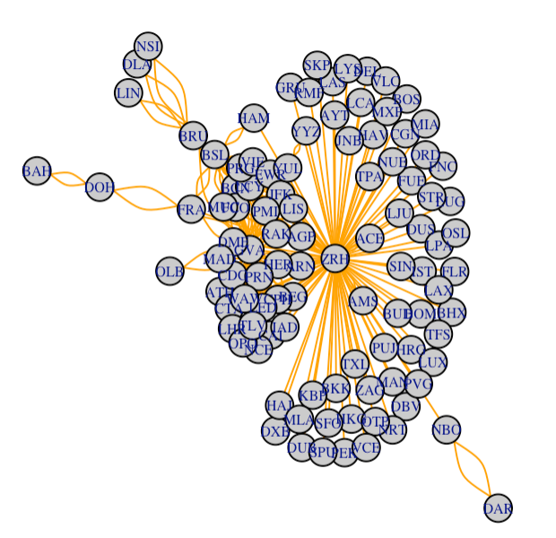

# Airport-Network
 
Find all destination airports given a particular starting airport hub

# ZRH

Run `airport-network.Rmd` report to generate maps. Here is a line graph output for the airport `ZRH` as an example:

